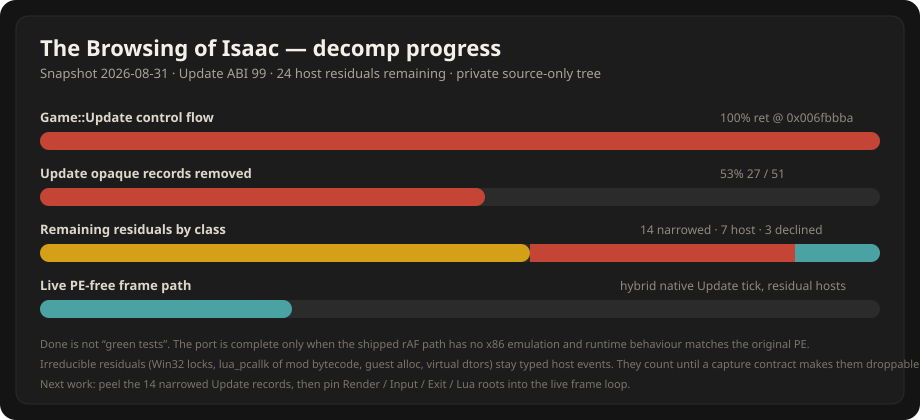

# The Browsing of Isaac

Private, source-only native/Wasm decompilation of **The Binding of Isaac: Repentance+**.

This tree is the decomp port itself: C++ translations, independent JavaScript oracles, recovered ABI contracts, and the browser host that drives them. It does **not** ship the game, assets, the PE, Ghidra projects, test harnesses, probe scripts, or emulator leftovers.

The original per-frame x86-emulation path is gone. Success is a live frame loop that no longer depends on the PE and that matches the original’s behaviour. A slice with green tests is not that.



| Track | State | Remaining |
| --- | --- | --- |
| `Game::Update` control flow | **Instruction-complete** (`ret` @ `0x006fbbba`) | Depth: collapse residual hosts |
| Update opaque records | **27 removed / 51 original** (53%) | **24** still fire a host event |
| Live frame loop | Native Update tick + typed residual hosts | Render / Input / Exit / Lua roots not PE-free |
| x86 emulation | Removed | Guard throws if anything re-enters it |

Numbers below are taken from tracked ABI constants on **2026-08-31**, not from the lagging narrative in older docs.

```
Update ABI 99    state 524 B    runtime 23696 B    events 1260 B    constants 32 B
```

---

## Legal

You must own the game. This repository never contains `isaac-ng.exe`, `resources/packed`, extracted ANM2/PNG/WAV, Ghidra databases, decompiler listings, or generated Wasm objects.

Local analysis input (not in git): `tools/isaac-ng.unpacked.exe`, SHA-256 `5129DF723E645DAAEA59514394195F3EA1DCE1671BB0433D724648A845017200`. Every RVA in this tree is version-bound to that hash.

---

## What is already translated

`Game::Update` (`0x006fadc0` → `0x006fbbba`) is fully walked. Every remaining Update problem is a **residual host call** inside that body, not missing control flow.

**27 records have been removed** (the coarse host event no longer fires when the capture is live). They now run as in-module decisions plus typed carriers:

| Removed | VA / name | When |
| --- | --- | --- |
| `0x004257b0` Pass A/B | vector insert, platform grow only | v71 |
| `opaqueGlobal4aba0Refresh` | `0x006fb414` blob-gated tree walk | v79 |
| `opaqueRoomTransitionEnginePrefix` | gated `ANM2::Load` | v98 |
| `opaqueCall004212c0` | frame-opaque 4212c0 | v99 |
| `opaqueCall0092e300` | SFX sound-group walk | v100 |
| `opaqueRoomUpdateTailMidRestock` | shop mid-restock | v108 |
| `opaqueCall006fd7c0` | frame-effect shell seam | v109 |
| `opaqueRoomUpdatePrefixB8` | path-cost grid | v110 |
| `opaqueRoomUpdateTailPath` | B19 rebuild + B20 trail | v114 |
| `opaqueRoomUpdateClearPath` | clear-path flag store | v115 |
| `opaqueRoomUpdateClearDoorSlots` / `ClearDoors` | door open + type-5 loop | v119 |
| `opaqueRoomUpdateTailEntity` | B18 entity walk | v120 |
| heartbeat SFX stop / play / update / parent | `0x0092e230` / `0x0092dc30` / `0x0092e560` | v121–v129 |
| `opaqueCall006fd7c0Mode4Sfx` | mode-4 SFX | v122 |
| `roomTriggerClearStats` | room-clear stats growth | v125 |
| `opaqueRoomUpdateTailMid7230Spawn` | timer spawn | v126 |
| `opaqueRoomUpdateTailMid706cExpire` | shop restock partial | v127 |
| `opaqueFrameEffect6fd7c0Shell` | SaveState shell | v129 |
| greed / deep-music / audio / awards bit-7 | `Room::TriggerClear` fragments | v131–v141 |

Eighteen helper **families** sit beside the Update slice. They are consumed by reference; do not re-derive them from the Update body.

| Family | ABI | Role |
| ---: | ---: | --- |
| Update slice | **99** | `Game::Update` capture / step / apply |
| Lua engine | **103** | class-create / install / property accessors |
| Room | **87** | room update, genrand, trigger-clear laws |
| ANM2 | **77** | sprite/animation helpers |
| Render shell | **74** | render-side probes |
| Render root slice | **73** | `Game::Render` continuations |
| Frame-opaque | **64** | 4257b0 / 4212c0 / list helpers |
| ProcessInput | **52** | input root helpers |
| Frame-effect | **51** | `0x006fd7c0` family |
| Exit | **48** | shutdown / smart-handle |
| Player manager | **45** | death / heartbeat / heal |
| PlayerHUD | **44** | stat bar / tween |
| SFX | **41** | play / stop / preload gates |
| HUD post-update | **39** | HUD poll / try_pure |
| PersistentGameData | **35** | serializer rows |
| Room-transition engine | **30** | `0x0082ee40` / `0x007abe20` |
| Log | **25** | level-gate; vsnprintf tail stays platform |
| Game state | **20** | snapshot / grid helpers |
| Alloc wrappers | **4** | wrapper logic; raw malloc stays host |

Standing decisions (full text in `docs/decomp-port.md`): Win32 critical sections are platform primitives but store *ordering* around them is game logic; logger `0x00a112c0` splits (level-gate translated, OutputDebugString/file tail host); CRT `sin`/`cos` are platform; guest allocator wrappers are game logic, raw `new`/`free` are not; original-binary defects are reproduced, never “fixed”.

---

## What still has to be completed

This is the honest remaining work. Narrowed ≠ removed. Declined ≠ TODO.

### 1. Twenty-four Update host residuals

These still emit a coarse host event (or a typed stand-in that is the residual). The live rAF path is **not PE-free** until each is either folded in-module under a capture contract, or permanently classified as a platform primitive with no game-logic leftover.

#### Peel candidates (narrowed — more of the body is already in-module)

| Idx | Name | VA | Blocker |
| ---: | --- | --- | --- |
| 0 | `opaqueCall009a2b30` | `0x009a2b30` | HUD PostUpdate. Latch/loop/flags/tail/walker are lawed; **`0x83b850` RecomputeAll is irreducible** (virtual dtors + registry + sized-frees). Record stays. |
| 3 | `opaqueCall0092f1c0` | `0x0092f1c0` | Cases 1–2 have pure tails; cases 0 and 3 **always** call Room `0x4186c0`. |
| 4 | `opaqueCall008318a0` | `0x008318a0` | Mode 0 in-module; modes 1–4 still host (ANM2 + walks). |
| 9 | `opaqueState24eccUpdate` | `0x008ef990` | Virtual Notify on `[0xc57b18]` + SFX Play. Assessed near-max. |
| 13 | `opaqueRoomUpdatePrefixB1` | room prefix B1 | Search / spawn / bind still typed-host. |
| 14 | `opaqueRoomUpdatePrefixB2` | `0x00802e20` | Item-pool/spawn special residual. |
| 15 | `opaqueRoomUpdatePrefixB3B7` | B3–B7 span | Residual plan; capture-capped. |
| 17 | `opaqueRoomUpdatePrefixB9B11` | B9–B11 span | Challenge / death-spawn residual. |
| 18 | `roomTriggerOutput` | `0x00823080` | Three host call classes after a pure scan. |
| 31 | `roomTriggerClearAwardsTail` | `0x008068f0` | Award-spawner + music bodies. Removal **declined** at v69; only narrowing left. |
| 32 | `opaqueCall0098dba0PlayerWalk` | `0x0098dba0` | Virtual `[[player+0x370]+0x14]` per matched player. |
| 34 | `opaqueRoomUpdateAmbient` | ambient span | H3/H5 gates pure; residual host. |
| 36 | `opaqueRoomUpdateTailWaterB16` | `0x00823540` | Water/lava floats lawed; type-7 spawn grid walks still host. |
| 43 | `playerManagerUpdateDeath` | `0x009bb5d0` | `TriggerDeath` mutates the vector mid-walk — cannot pre-decide later iterations. |

#### Still a monolithic host body

| Idx | Name | VA | Why it is still host |
| ---: | --- | --- | --- |
| 2 | `opaqueMenuGateUpdate` | `0x009b6840` | 645-insn menu UI (ANM2 × many, FCO, walks). Fires every frame. |
| 5 | `opaqueCall0098dba0` | `0x0098dba0` | Player-walk residual over manager entries. |
| 6 | `opaqueCall00746560` | `0x00746560` | Unbounded `std::string` + ANM2 widget. Gate is typed. |
| 8 | `opaqueMenuGateOpen` | `0x009b7680` | ~1979-insn menu-open cluster. |
| 11 | `opaqueCall006fdc10` | `0x006fdc10` | Frame-effect nested stage body. |
| 35 | `opaqueRoomUpdateTailRain` | `0x00802a80` | Entity search/create/bind loop. |
| 37 | `opaqueRoomUpdateTailMid` | mid tail | Curse / `0x801ee0` / `0x800500` always-path. |

#### Assessed and declined (do not re-open without new evidence)

| Idx | Name | VA | Why it stays |
| ---: | --- | --- | --- |
| 7 | `opaqueCall0040c7f0` | `0x0040c7f0` | Refcounted smart-handle `operator=`. Always-path: `new`, `InitializeCriticalSection`, Enter/Leave, virtual dtor, second registry lock. |
| 22 | `opaqueRoomTransitionEngineBody` | engine body | `ANM2::Reset` + `AnimationState::Rewind` write heap **outside** the Game capture ABI. |
| 48 | `opaqueCall008607a0` | `0x008607a0` | `lua_pcallk` of a runtime registry function (mod bytecode with game-API side effects). Last call before `Game::Update` `ret`. |

**Exact next Update target:** the highest-leverage peel on a *reachable* narrowed record that is not in the declined set. Record 0 will not leave the ledger; skip it. Prefer a record whose removal converts many host edges into one pure decision (B-prefix / TriggerOutput / 8318a0 modes) over another menu-body census.

### 2. Sibling families are not “done” at high ABI numbers

ABI version counts landings, not completion. Remaining family depth the Update residuals still call:

- **ANM2** — `Load` / `Reset` / `Rewind` / overlay play still appear as typed hosts on records 4, 8, 22.
- **Room** — spawn (`0x428b20`), search (`0x813520`), bind, water-band type-7 cells.
- **SFX** — `Play` is typed; device virtuals (`vtbl+0x3c/+0x40/+0x58`) stay platform audio.
- **Lua** — install surface is complete at 383 `pushcclosure` sites; `lua_pcallk` of mods is record 48.
- **Render root** — wired on its own `*(Game+0x18300)` buffer; tail bodies at `0x00817b53` / `0x0081d20a` class remain.
- **ProcessInput / Exit** — helpers exist; they are **not** the live rAF roots yet.

### 3. Live frame path (the actual product)

`web/js/app.js` order is Input → Update → Render → paint. Today:

| Seam | Status |
| --- | --- |
| Update tick | Native Wasm slice, ABI 99, `usesX86Emulation = false` |
| Residual hosts | Typed events from the 24 records above; executed in JS, not in the PE |
| Render tick | Render-root slice driven from the Update bridge; GL via `render-host-gl.js` |
| Input | Host-side key-edge bridge, not the recovered `ProcessInput` root |
| Exit / Lua VM | Not pinned as live roots |
| Capture | Sparse Game buffer + host-owned Room overlay; many blob lanes still optional |

Until Render/Input/Exit/Lua are live roots **and** the 24 residuals are either folded or proven platform-only, the browser loop is a hybrid. That is progress. It is not the finish line.

### 4. Verification still required on every landing

This snapshot deliberately **omits** `tests/` and probe scripts. The translation is not thereby unverified — `scripts/decomp/verify-game-update-slice.mjs` is the native-vs-oracle differential. After any ABI bump, before calling a boundary done:

```bat
call %USERPROFILE%\emsdk\emsdk_env.bat
npm run decomp:build-slice
npm run decomp:verify-slice
node scripts/check-repo-safety.mjs
```

`output/decomp/wasm-slice/` is generated locally and stays gitignored.

---

## Layout

| Path | What it is |
| --- | --- |
| `decomp/game-update-slice.json` | Recovered offsets, predicates, 24 remaining + 27 resolved boundaries |
| `decomp/game-render-slice.json` | Render-root contract |
| `decomp/port-roots.json` | Signature-backed root requests |
| `native/decomp/` | Freestanding C++20 translations (Update slice + 18 families) |
| `scripts/decomp/*-model.mjs` | Independent JS oracles — not generated from the C++ |
| `scripts/decomp/frame-path.mjs` | Shipped frame-path selector, hybrid tick, residual host handler |
| `scripts/decomp/build-*.mjs` / `verify-*.mjs` | Wasm build + differential |
| `web/js/native-update-bridge.js` | Browser boot of the native Update session |
| `web/js/render-host-gl.js` | Typed render-host events → WebGL2 |
| `web/js/capture-wiring.js` | Live guest-memory capture lanes for blob-gated pures |
| `docs/decomp-port.md` | Chronological ABI log (trust ABI constants over the prose if they disagree) |
| `docs/decomp-runtime-wiring.md` | How rAF actually calls the slices |
| `AGENTS.md` | Port rules, defect classes, evidence requirements |

---

## Build

Requires Node 18+ and Emscripten 6.x. The PE is **not** required to build the slices.

```bat
cd path\to\the-browsing-of-isaac
call %USERPROFILE%\emsdk\emsdk_env.bat
npm run decomp:build-slice
npm run decomp:build-render-slice
```

`identify-zhl-address.mjs` needs a local unpacked PE and the [REPENTOGON](https://github.com/TeamREPENTOGON/REPENTOGON) signature database checked out beside the tree (not vendored here).
